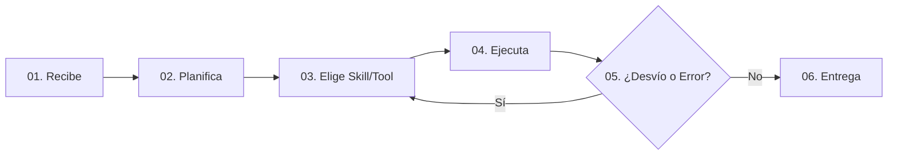

# RAVA S.A. — Módulo 3: Agentes Autónomos y Arquitectura de Skills

Módulo interactivo de capacitación corporativa para **RAVA S.A.** (Vialidad, Infraestructura Vial, Compras, Obras y Logística).

**Capacitación:** Inteligencia Artificial Aplicada al Entorno Corporativo  
**Autores:** Brian Ruiz Moreno & León Schwegler  
**Edición:** 2026

---

## 🧭 Propósito del Módulo

Este módulo formativo está diseñado para guiar a colaboradores, ingenieros, jefes de compras y directivos en la transición desde los **chatbots conversacionales** tradicionales hacia los **Agentes de IA Autónomos** dotados de **Skills (Habilidades procedimentales)** y capacidad de auto-corrección (*ReAct Loop*).

---

## 📂 Estructura de la Carpeta `/agente`

```text
├── index.html        # Aplicación web interactiva del Módulo de Agentes y Skills
├── assets/           # Logotipos institucionales y favicons
└── README.md         # Documentación técnica y pedagógica del módulo
```

---

## 🧠 Marco Teórico y Pedagógico

### 1. La Diferencia Fundamental: Chatbot vs. Agente
* **Chatbot:** Genera texto descriptivo dentro de la ventana de chat. La ejecución y la verificación manual siguen recayendo 100% en el usuario.
* **Agente con Skills:** Descompone la meta, activa el procedimiento técnico adecuado (*Skill*), ejecuta herramientas reales (OCR, ERP, planillas, cronogramas), detecta inconsistencias y entrega el trabajo verificado.

---

### 2. El Ciclo Operativo en Seis Pasos



1. **Recibe:** Captura el objetivo de negocio y lee el contexto de memoria.
2. **Planifica:** Descompone el objetivo en tareas operativas ordenadas.
3. **Elige:** Selecciona la Skill de procedimiento y las herramientas necesarias.
4. **Ejecuta:** Realiza la acción digital y lee el resultado real de los sistemas.
5. **Corrige:** Si detecta discrepancias, replantea la estrategia y reintenta dentro del bucle.
6. **Entrega:** Estructura el entregable final, deja trazabilidad en bitácora y solicita aprobación humana (*Human-in-the-Loop*) para acciones sensibles.

---

### 3. Las Seis Piezas Esenciales de un Agente

| # | Pieza | Definición Técnica | Analogía RAVA S.A. | Si Falta... |
| :-: | :--- | :--- | :--- | :--- |
| **01** | **Objetivo** | Meta cuantificable y clara | El destino del taxi | Da vueltas en círculos y responde con texto vago. |
| **02** | **Instrucciones** | Reglas, guardrails y límites | Reglamento y normas de seguridad | Borra archivos o compromete datos sin autorización. |
| **03** | **Memoria** | Historial y variables persistentes | Bitácora y libro diario de obra | Hay que repetir el contexto y proveedores en cada mensaje. |
| **04** | **Herramientas** | Interfaces I/O (APIs, OCR, ERP) | Kit de llaves y maquinaria del taller | Solo opina: es un chatbot tradicional sin manos. |
| **05** | **Skills** | Manual de procedimiento y método experto | Protocolo técnico DNV de pavimentación | Improvisa los pasos y se saltea validaciones críticas. |
| **06** | **El Bucle** | Capacidad ReAct de auto-corrección | Ajustar la llave hasta que encaje | Se rinde ante el primer error inesperado. |

---

## 🧩 Arquitectura de Skills (*Progressive Disclosure*)

Una **Skill** es un paquete autocontenido de conocimiento procedimental y heurístico. Permite estandarizar procesos operativos sin saturar la memoria del modelo.

### Flujo de Inyección Bajo Demanda:
1. **Catálogo en Reposo:** El agente solo conoce el nombre y una breve descripción de cada skill.
2. **Activación Semántica:** Al recibir una tarea relacionada (ej. cruce de remitos), carga el procedimiento paso a paso.
3. **Referencias Profundas:** Carga tablas de tolerancias y anexos únicamente cuando la tarea lo requiere.

---

## 🏗️ Casos de Uso Reales en RAVA S.A.

1. **Auditoría de Remitos de Cantera vs. Órdenes de Compra (Compras):**
   - Lectura OCR de remitos escaneados.
   - Cruce contra la OC activa en el ERP Physis.
   - Aplicación de matriz de tolerancias ($\pm 2\%$ por humedad en áridos).
   - Generación de tabla comparativa y alerta para el Jefe de Compras.

2. **Auditoría de Pliegos Licitatorios (Licitaciones & Técnica):**
   - Extracción de equipo mínimo obligatorio (fresadoras, terminadoras, camiones).
   - Cruce contra el parque de maquinaria disponible.
   - Detección de fórmulas polinómicas de reajuste y penalidades por mora.

3. **Control de Partes Diarios y Rendimiento de Combustible (Taller & Logística):**
   - Consolidación de horas máquina trabajadas y litros cargados.
   - Cálculo de ratio $\text{Litros/Hora}$.
   - Detección de desvíos superiores al $15\%$ sobre la curva estándar.

---

## 🎮 Componentes Interactivos de la Plataforma

* **Comparador de Respuestas:** Visualización animada de un chatbot vs. un agente con skills.
* **Reproductor del Paso a Paso:** Control interactivo con auto-avance, pausa y teclado.
* **Tarjetas Flip 3D:** 6 tarjetas giratorias con analogías viales y análisis de fallos.
* **Consola ReAct (Demo en Vivo):** Simulador de razonamiento, ejecución de herramientas y auto-corrección.
* **Quiz Dinámico:** 6 preguntas con puntuación y retroalimentación inmediata.
* **9 Trucos con Prompt Copiable:** Plantillas listas para copiar con un clic.
* **Plantilla de Arranque y Checklist:** Checklist con guardado local automático (`localStorage`).
* **Glosario de Bolsillo:** 9 términos fundamentales con analogías prácticas.

---

## 🚀 Ejecución y Compatibilidad

* **Sin Dependencias:** Abrir `agente/index.html` en cualquier navegador moderno.
* **Accesibilidad:** Diseñado bajo directrices **WCAG 2.1 AA** con soporte para navegación por teclado y `prefers-reduced-motion`.
* **Navegación Fluida:** Conexión directa de ida y vuelta con el Módulo 2 (`../index.html`).

---

## 📄 Licencia y Derechos

Material de capacitación técnica desarrollado exclusivamente para **RAVA S.A.** — Todos los derechos reservados © 2026.
